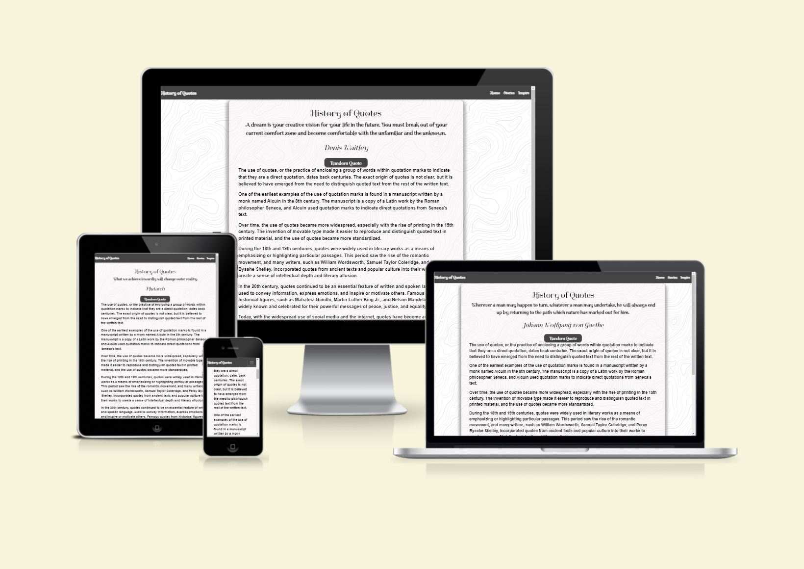

# History of Quotes

[View the live project here.](https://marius-george.github.io/Milestone-Project-2/)

This is a small website dedicated to quotes. Its purpose is to provide the user with a brief history of quotes and to present some stories in which quotes have had an impact on people. The main feature is to generate random quotes, copy them to the clipboard, and post them on Twitter with just two clicks.



## User Experience (UX)

-   ### User stories

    -   #### First Time Visitor Goals

        1. As a First Time Visitor you have access to a large quote database. This can provide you with a source of inspiration and positive energy.
        2. The ability to explore a brief history of quotes and their impact on people.
        3. The function of generating random quotes, which allows you to discover new and interesting quotes.
        4. The ability to copy quotes to clipboard and use them in other applications or projects.
        5. The Twitter posting function which allows you to share quotes with your followers on Twitter.

    -   #### Returning Visitor Goals

        1. As a Returning Visitor you can discover new and inspiring quotes by using quote generator.
        2. To revisit quotes and share new ones with friends on Twitter.
        3. To view more stories about quotes and how quotes have had an impact on people and learn from them.

    -   #### Frequent User Goals
        1. To continue discovering new and inspiring quotes by using the random quote generator and save them for later use.
        2. To regularly post quotes on Twitter and increase your followers and share them with people that have the same interest.
        

-   ### Design
    -   #### Colour Scheme
        -   The two main colours used are white and grey.
    -   #### Typography
        -   The Spirax font is the main font used throughout the whole website with Sans Serif as the fallback font in case for any reason the font isn't being imported into the site correctly. 

    -   #### Imagery
        -   No imagery used to maintain an old look.

*   ### Wireframes

    -   Home Page Wireframe - [View](https://ibb.co/wJJCz1m)

    -   Mobile Wireframe - [View](https://ibb.co/NC8SGYd)

    -   Quote Generator Wireframe - [View](https://ibb.co/PQr0XtK)

    

## Features

-   Responsive on all device sizes 

-   Interactive menu bar with hambuger icon on small devices.

-   A random quote generator function with more that 1000 quotes.

-   Post to Twitter feature

-   Copy to clipboard quote function.

## Technologies Used

- HTML
- CSS
- Bootstrap
- Java Script
- API (Application Programming Interface)

### Languages Used

-   [HTML5](https://en.wikipedia.org/wiki/HTML5)
-   [CSS3](https://en.wikipedia.org/wiki/Cascading_Style_Sheets)
-   [Bootstrap](https://en.wikipedia.org/wiki/Bootstrap)
-   [Java Script](https://en.wikipedia.org/wiki/JavaScript)

### Frameworks, Libraries & Programs Used

1. [Bootstrap 4.4.1:](https://getbootstrap.com/docs/4.4/getting-started/introduction/)
    - Bootstrap was used to assist with the responsiveness and styling of the website.
1. [Hover.css:](https://ianlunn.github.io/Hover/)
    - Hover.css was used on the Social Media icons in the footer to add the float transition while being hovered over.
1. [Google Fonts:](https://fonts.google.com/)
    - Google fonts were used to import the 'Titillium Web' font into the style.css file which is used on all pages throughout the project.
1. [Git](https://git-scm.com/)
    - Git was used for version control by utilizing the Gitpod terminal to commit to Git and Push to GitHub.
1. [GitHub:](https://github.com/)
    - GitHub is used to store the projects code after being pushed from Git.
1. [Balsamiq:](https://balsamiq.com/)
    - Balsamiq was used to create the [wireframes](https://github.com/) during the design process.

## Testing

The W3C Markup Validator and W3C CSS Validator Services were used to validate every page of the project to ensure there were no syntax errors in the project.

-   [W3C Markup Validator](https://validator.w3.org/#validate_by_input) - [Results](https://ibb.co/1ZVvRp6)
-   [W3C CSS Validator](https://jigsaw.w3.org/css-validator/#validate_by_input) - [Results](https://ibb.co/BPQ6vjJ)

### Testing 
1. With the website opened I made sure that when you click on the logo and Home link it goes to the homepage.
2. When in mobile mode navbar display hamburger button and open link with hoover effect corectly.
3. All links in navbar work.
4. When pressing tweet this button it opens new window with twitter webpage and quotes already written in text box.
5. Copy quote button when pressed copies quote from quote generator and displays an alert saying that the quote has been copied.
6. Used Chrome developers tools to resize the webpage and it was responsive at all resolutions.


### Further Testing

-   The Website was tested on Google Chrome, Mozilla Firefox, Microsoft Edge and Safari browsers.
-   The website was viewed on a variety of devices such as Desktop, Laptop, iPad, Samsung Galaxy TAB, iPhone 13 and Samsung Galaxy S22.

### Bugs

- When the website is displayed in mobile viewport the copy quote button does not have top padding in inspire page.
-


## Deployment

1. Deployment has been made in github using the following commands:
  - git status to check the status of the files in github
  - git add . to add all modified files
  - git commit -m "example text" to index all that has been modified to the website
  - git push to upload the website in the cloud
  - python3 -m http.server in the terminal to view the page working in a separate tab of the web browser.


### GitHub Pages

The project was deployed to GitHub Pages using the following steps...

1. Log in to GitHub and locate the [GitHub Repository](https://github.com/)
2. At the top of the Repository (not top of page), locate the "Settings" Button on the menu.
    - Alternatively Click [Here](https://raw.githubusercontent.com/) for a GIF demonstrating the process starting from Step 2.
3. Scroll down the Settings page until you locate the "GitHub Pages" Section.
4. Under "Source", click the dropdown called "None" and select "Master Branch".
5. The page will automatically refresh.
6. Scroll back down through the page to locate the now published site [link](https://github.com) in the "GitHub Pages" section.

### Forking the GitHub Repository

By forking the GitHub Repository we make a copy of the original repository on our GitHub account to view and/or make changes without affecting the original repository by using the following steps...

1. Log in to GitHub and locate the [GitHub Repository](https://github.com/)
2. At the top of the Repository (not top of page) just above the "Settings" Button on the menu, locate the "Fork" Button.
3. You should now have a copy of the original repository in your GitHub account.

### Making a Local Clone

1. Log in to GitHub and locate the [GitHub Repository](https://github.com/)
2. Under the repository name, click "Clone or download".
3. To clone the repository using HTTPS, under "Clone with HTTPS", copy the link.
4. Open Git Bash
5. Change the current working directory to the location where you want the cloned directory to be made.
6. Type `git clone`, and then paste the URL you copied in Step 3.

```
$ git clone https://github.com/YOUR-USERNAME/YOUR-REPOSITORY
```

7. Press Enter. Your local clone will be created.

```
$ git clone https://github.com/YOUR-USERNAME/YOUR-REPOSITORY
> Cloning into `CI-Clone`...
> remote: Counting objects: 10, done.
> remote: Compressing objects: 100% (8/8), done.
> remove: Total 10 (delta 1), reused 10 (delta 1)
> Unpacking objects: 100% (10/10), done.
```

Click [Here](https://help.github.com/en/github/creating-cloning-and-archiving-repositories/cloning-a-repository#cloning-a-repository-to-github-desktop) to retrieve pictures for some of the buttons and more detailed explanations of the above process.

## Credits

- 


### Content

-   Partial content was written by the developer.
-   

### Media

-   No media used for this website.

